# SolidWorks Projects

A collection of CAD/CAM/CAE projects completed during academic coursework and as personal hobby builds.
Covers parametric modeling, FEM simulations, topological optimization and 3D-printed parts.

**Tools:** SolidWorks 2023 · FDM 3D Printing · SolidWorks Simulation · Autodesk Fusion 360

---

## Projects

| Preview | Project | Description | Techniques |
|---------|---------|-------------|------------|
| 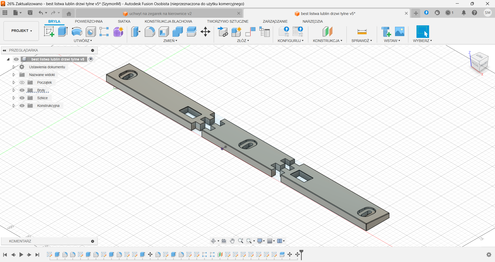 | Door latch strip — Lublin van | Designed a missing latch strip to hold the rear door of a Lublin van closed properly | Fusion 360, 3D printing |
| 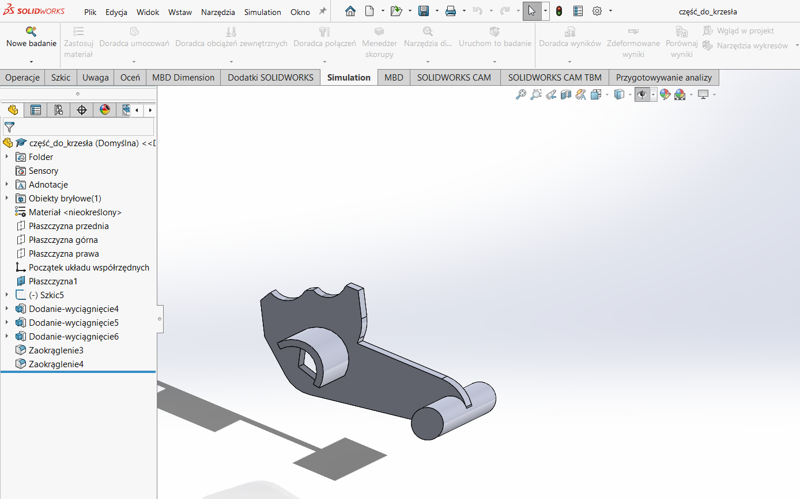 | Chair tilt mechanism part | Reverse engineered and printed a replacement part for a swivel chair mechanism responsible for backrest angle adjustment | SolidWorks, 3D printing |
| 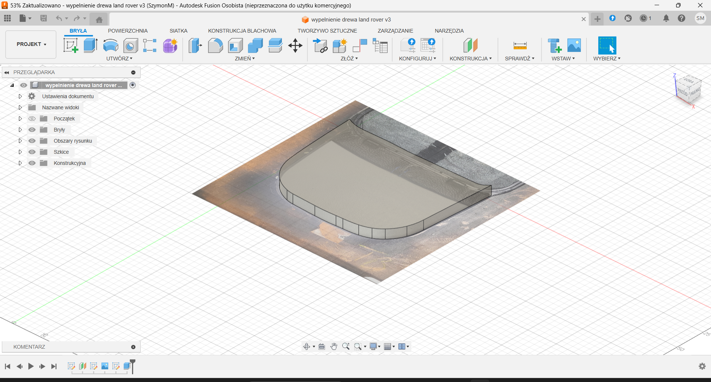 | Wooden trim panel insert | Recreated a missing piece of a car interior wooden trim panel as part of a full restoration | Fusion 360, 3D printing |
| 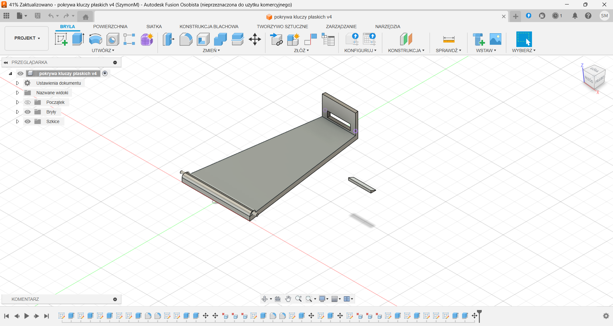 | Flat key set cover | Designed a simple hinged cover for a set of flat keys | Fusion 360, 3D printing |
| 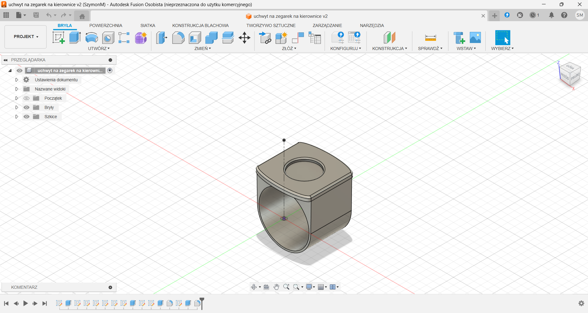 | Sports watch mount for bicycle handlebar | Designed a mount allowing secure and readable attachment of a sports watch to a bicycle handlebar | Fusion 360, 3D printing |
| 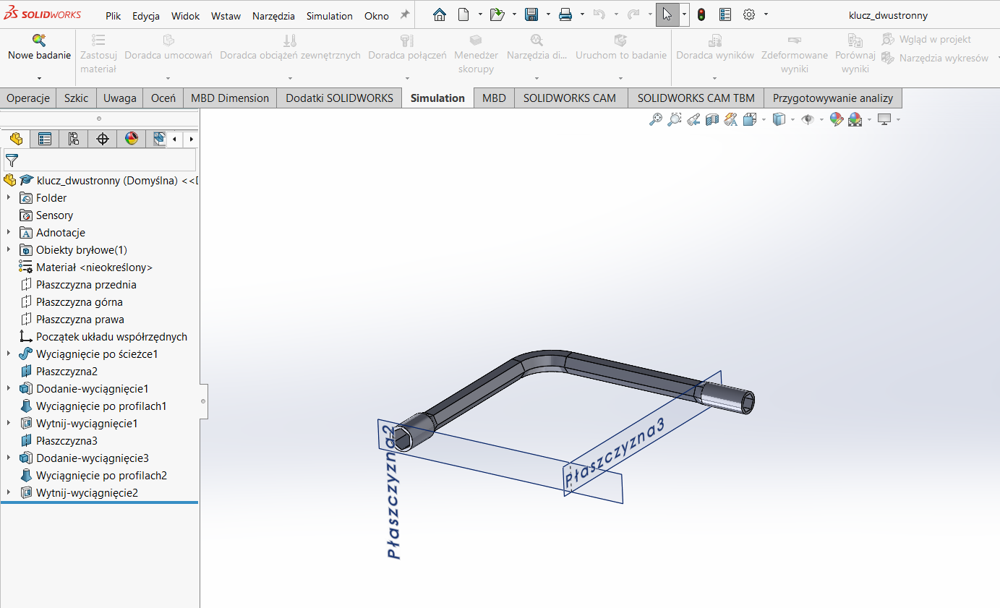 | Double-ended socket wrench | Modeled a bent double-ended socket wrench with different socket sizes on each side | SolidWorks: parts |
| 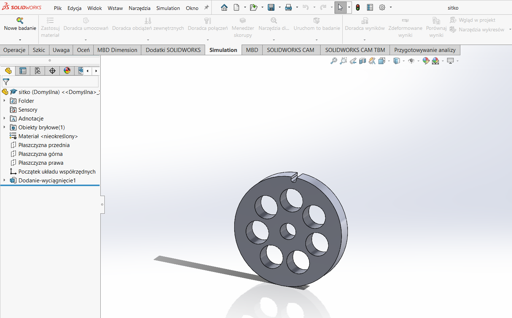 | Meat grinder sieve | Modeled a sieve plate used in a manual meat grinder | SolidWorks: parts |
| 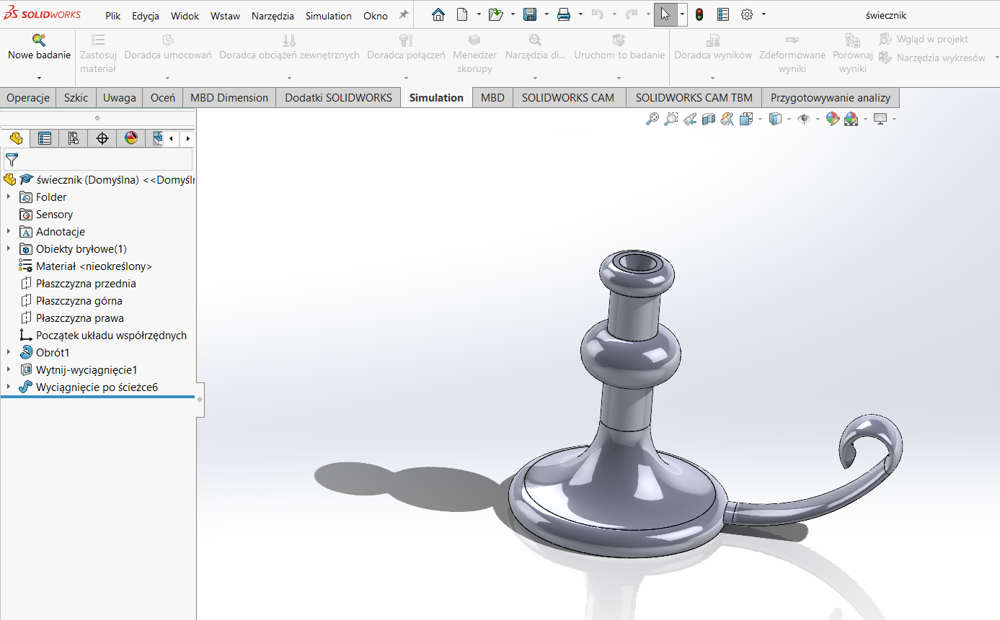 | Decorative candleholder | Modeled an ornamental candleholder as a surface and feature modeling exercise | SolidWorks: parts |
| 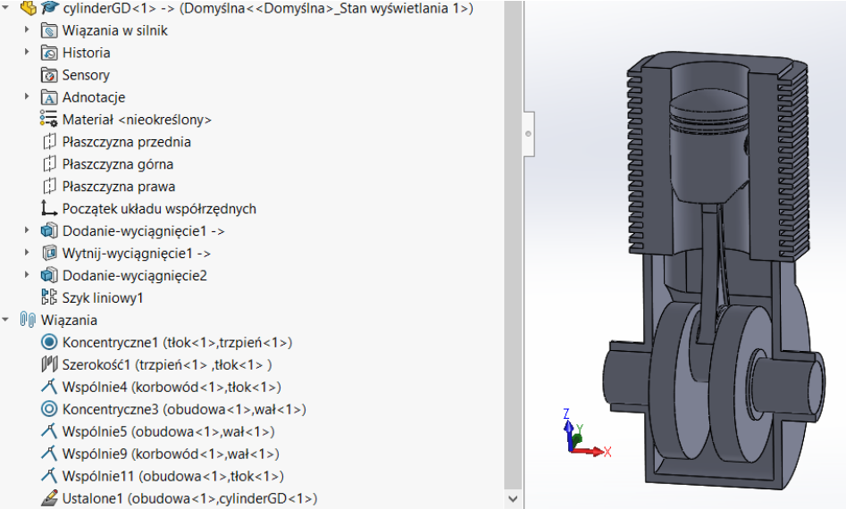 | Single-cylinder engine model | Modeled a simple single-cylinder engine similar to a motorcycle engine, including full assembly | SolidWorks: parts, assemblies (top-down & bottom-up) |
| 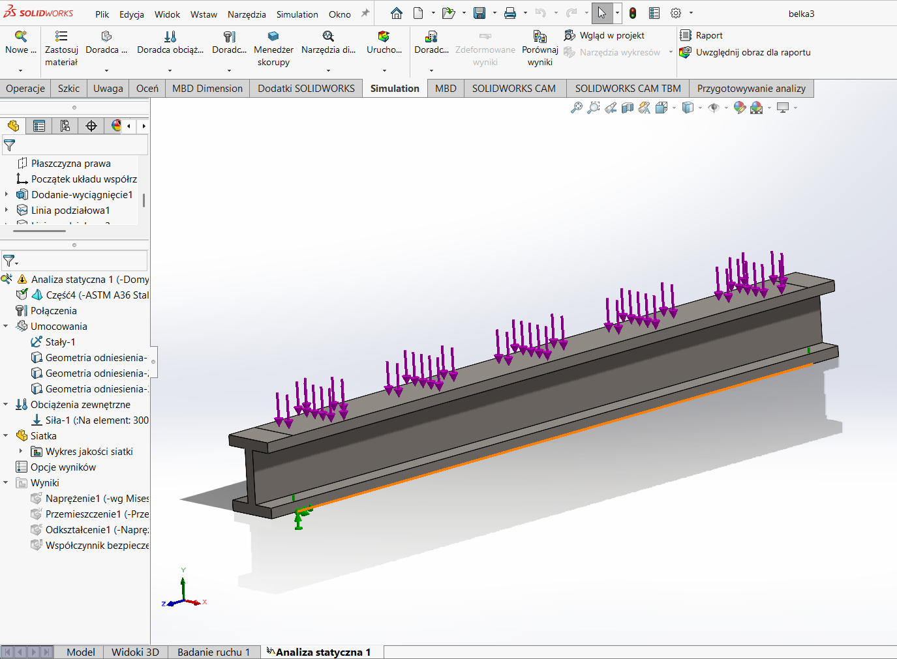 | Beam stress analysis | Created multiple beams with varying cross-sections and materials to compare their structural performance | SolidWorks: parts, simulation (Von Mises stress, safety factor, displacement) |
| 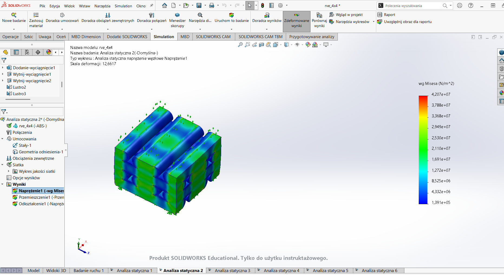 | RVE Young's modulus study | Modeled a multi-layer composite mimicking parallel-line 3D print infill and studied its effective stiffness | SolidWorks: parts, simulation |
| 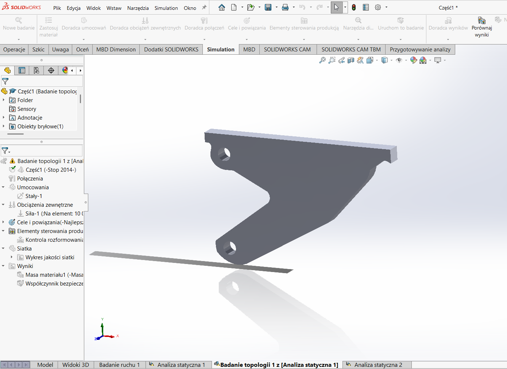 | Bracket — topological optimization | Designed a structural bracket using topological optimization to determine the optimal shape and minimize mass while maintaining strength | SolidWorks: parts, topological optimization, simulation |

---

## About

3rd year Technical Computer Science student at AGH University, Kraków.  
These projects were completed as part of CAD/CAM/CAE coursework and personal maker projects (camper van parts, electronics enclosures, custom hardware, spare parts, etc.).

📫 [szymonmakow123@gmail.com](mailto:szymonmakow123@gmail.com)